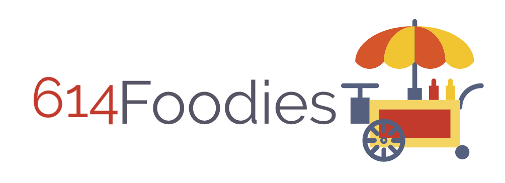
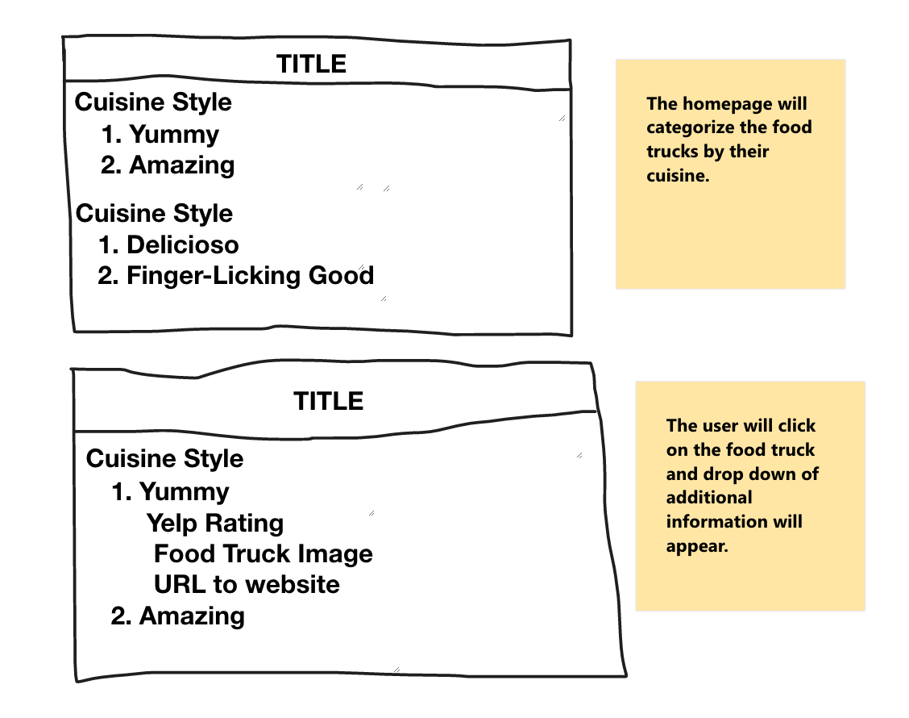

# **Mission Statement**
### 614Foodies offers a unique experience for food lovers by providing information on the best food trucks in Columbus.

# **MVP**
### 614Foodies apps will sort different food trucks in the area based on the cuisine style. For instance, if someone has a taste for BBQ then they will be able to scroll to the option for that food and bring up all the food trucks that offer that category of food.
### The routes in my application will include a home page as well as routes that will change the screen depending on the type of food truck (after selecting a cuisine) selected by the user.

# **MVP Features Description**

* Use ng new generator to start 614Foodies angular app
* Use angular routing to show the different food trucks that offer that category of food
* Use angular routing to show the different food trucks that offer that category of food based on cuisine selection on the home page
* Use hard coded information about different food trucks and the type of food that they serve in the Columbus region
* At least 5 components: American, Breakfast, BBQ, Latin American, Dessert.
** eatures Description
Use ng new generator to start 614Foodies angular app
Use angular routing to show the different food trucks that offer that category of food
Use angular routing to show the different food trucks that offer that category of food based on cuisine selection on the home page
Use hard coded information about different food trucks and the type of food that they serve in the Columbus region
    * At least 5 components: American, Breakfast, BBQ, Latin American, Dessert.
* Must use Angular services and Angular directives:
    * I am going to use ngswitch to show additional information about the food truck that the user selects once the user narrows their selection down to their respective cuisine choice. When the user selects a food truck additional information, such as a link to an URL to the food truck website will appear.
* nstalling bootsrap to create the table of elements. 
* Will use models to make classes to that contain information on each food truck 
* Will run ng serve to make sure that the app renders in the browser

c

* GPS location of the food trucks.
* Ability for users to place order ahead of time. 
* Incorporate food delivery apps like UberEats, GrubHub, DoorDash.

# **Wireframe**

# **Projected Schedule**

| Column 1       | Column 2     | Column 3     |
| :------------- | :----------: | -----------: |
|  Cell Contents | More Stuff   | And Again    |
| You Can Also   | Put Pipes In | Like this \| |